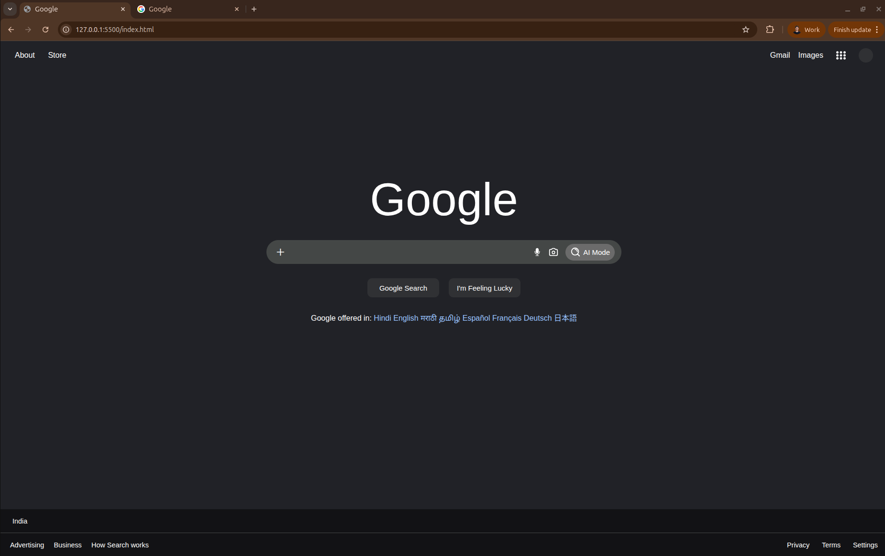

# Google Landing Page Clone

A simple Google search page copy made with HTML and CSS based on the dark theme.

## What's this?

This is my Assignment-0 I recreated the Google search homepage. It looks like the real Google but with a dark mode design. Everything is built from scratch using plain HTML and CSS.

## Files & Folders in this project

**index.html** - The structure of the page
- Header with links (About, Store, Gmail, Images)
- Big Google header written in the middle
- Search bar with microphone and image search icons
- Footer with language options

**index.css** - All the styling
- Dark background
- White text that's easy to read
- Flexbox layout for everything
- Nice hover effects on buttons and links
- Mobile-friendly responsive design

**Screenshot.png** - The image of the landing page been created

**images** - Containes the screenshot of the image

## How to use it

Just open the `index.html` file in your browser and you'll see the Google homepage clone!

## Features

Dark theme - easier on the eyes  
Centered search bar with icons  
Works on different screen sizes  
Hover effects on all clickable stuff  
Clean and simple design  

## What you need

Any modern web browser (Chrome, Firefox, Safari, Edge, etc.) - that's it!

## The Design

Here's how it looks:

